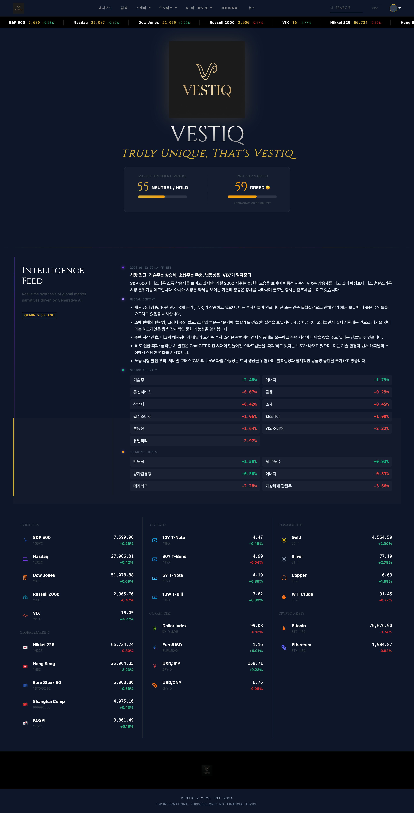
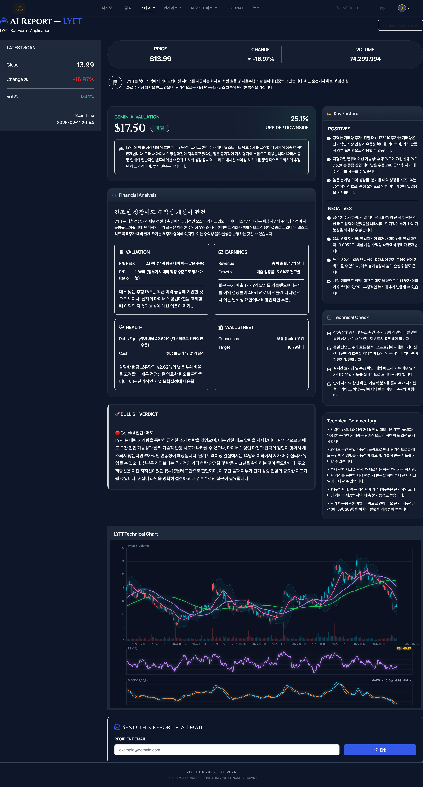
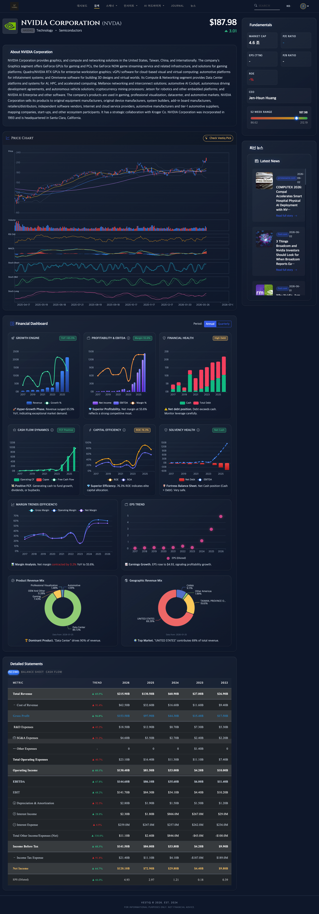
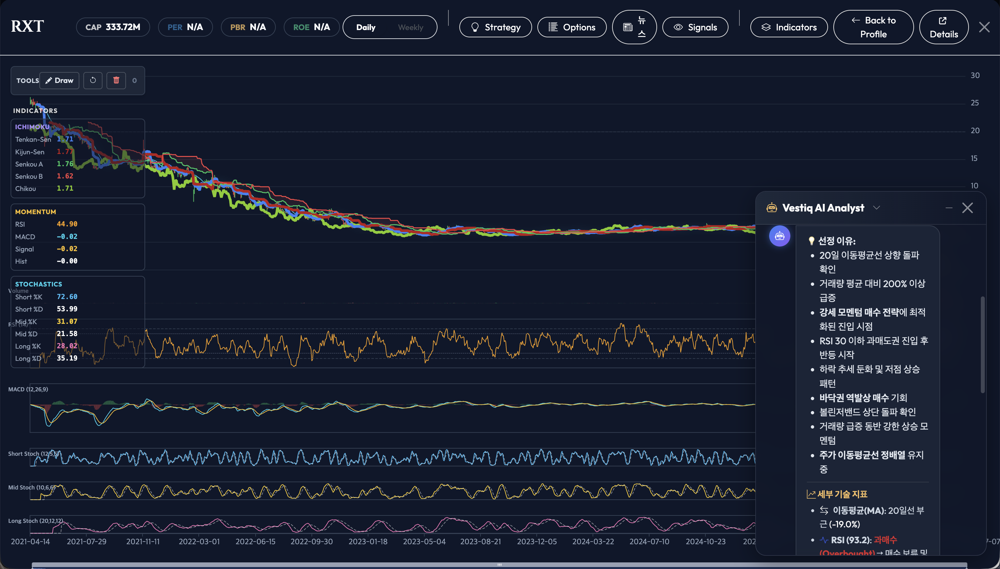
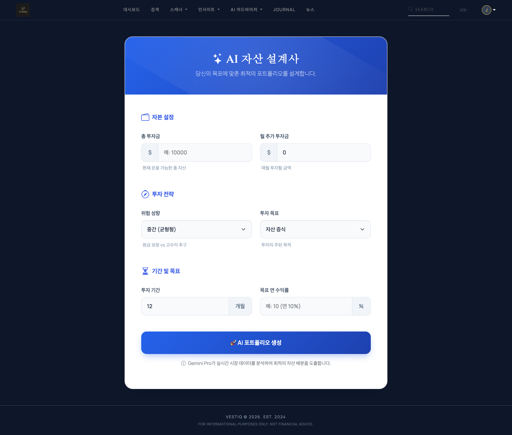
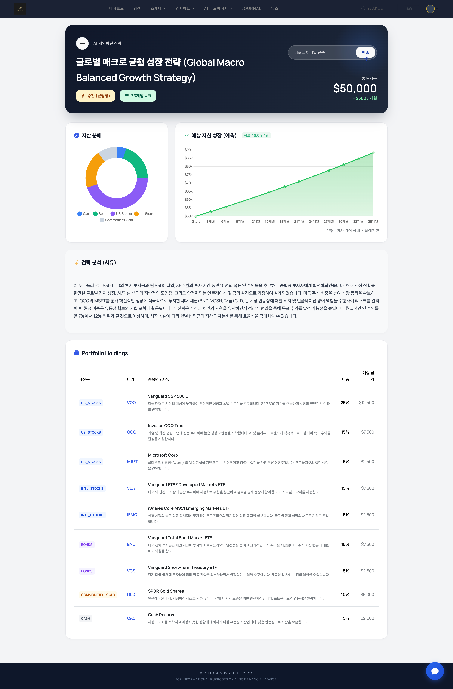
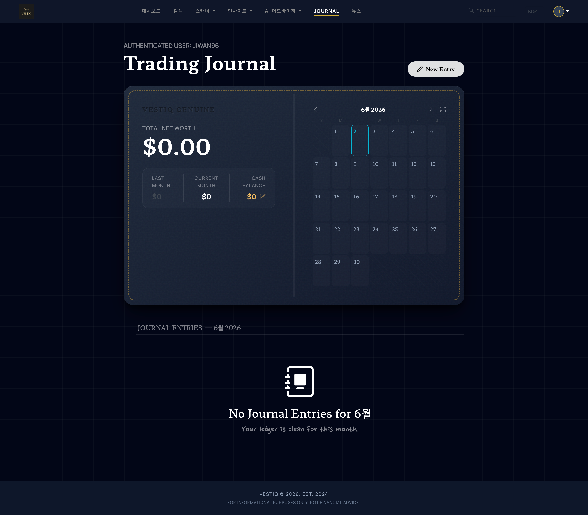
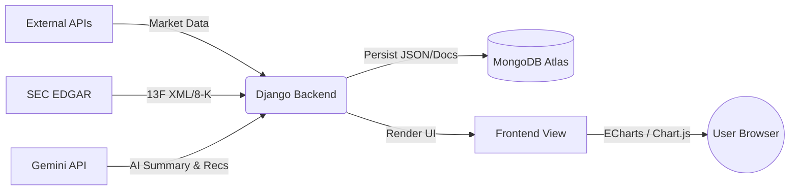
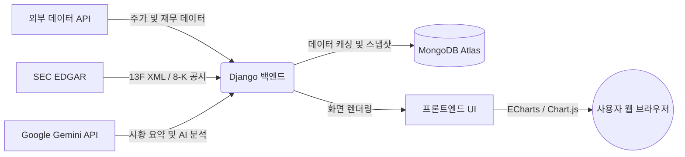

  
  
  # Vestiq AI: Intelligent Quant & Market Insight Platform
  
  
  
  
  
  

_Vestiq AI is an automated quantitative analysis and AI-driven market insight platform designed to help investors make data-driven decisions based on SEC filings, macro data, and LLM-powered recommendations._

[**🇺🇸 English**](#english) | [**🇰🇷 한국어**](#korean)

 

---

<h2 id="english">🇺🇸 English</h2>

### 📌 Overview

**Vestiq AI** integrates multiple external data sources (SEC EDGAR, yfinance, FMP) with Google's Gemini LLM to provide deep, institutional-grade market intelligence. By automating the parsing of highly complex 13F SEC XML filings and utilizing generative AI for earnings report summarization, Vestiq bridges the gap between raw financial data and actionable trading insights.

### 📸 Screenshots

_(Please replace the placeholders below with your actual screenshots)_

|                                    Main Page                                    |                                         Scanner                                         |
| :-----------------------------------------------------------------------------: | :-------------------------------------------------------------------------------------: |
|               |                          |
|                                 **Vestiq Pick**                                 |                                  **Scanner AI Report**                                  |
|          |      |
|                                **Search Ticker**                                |                                   **Chart Analysis**                                    |
|      |            |
|                             **AI Portfolio Input**                              |                                 **AI Portfolio Result**                                 |
|  |  |
|                               **Trading Journal**                               |                                                                                         |
|  |                                                                                         |

### ✨ Key Features

- **🤖 AI-Powered Trading Recommendations**: Utilizes Google Gemini API to analyze market weather, technical indicators, and news, generating concrete Buy/Hold/Avoid recommendations with dynamic stop-loss/take-profit targets. Built-in fallback mechanisms handle API rate limits gracefully.
- **🏦 SEC 13F XML Automation**: Directly pulls and parses quarterly 13F-HR filings from the SEC EDGAR API, calculating institutional portfolio adjustments (new, increased, decreased, exited) of major gurus (e.g., Warren Buffett) in real-time.
- **🌌 Galaxy Market Lab (Data Visualization)**: Visualizes the market universe using Chart.js/ECharts. Features include Constellation Maps (clustering by sector), Risk Radars, and Flow Orbits based on market cap and daily returns.
- **📈 Advanced Quant Scanner**: Custom algorithmic screeners capable of filtering 500+ US stocks based on multi-timeframe technical setups (Day, Swing, Long).

### 🛠 Tech Stack

- **Backend**: Python 3, Django, APScheduler (Cron Jobs), BeautifulSoup4
- **Frontend**: HTML5/CSS3, Vanilla JS, Bootstrap 5, ECharts, Chart.js, Tailwind-inspired Dark Theme
- **Database**: SQLite (Local) / MongoDB Atlas (Document Store for 13F)
- **APIs**: Google Gemini 2.0 Flash, SEC EDGAR, yfinance, Financial Modeling Prep (FMP)

### 🏗 Architecture

---

<h2 id="korean">🇰🇷 한국어</h2>

### 📌 프로젝트 소개

**Vestiq AI**는 방대한 금융 데이터(SEC 공시, 주가, 거시경제 지표)를 수집하여 Google Gemini 생성형 AI와 결합, 개인 투자자에게 기관급 퀀트 분석 및 투자 인사이트를 제공하는 웹 플랫폼입니다. 복잡한 미국 증권거래위원회(SEC)의 13F 보고서를 자동 파싱하고, 실시간 시장 데이터를 기반으로 AI 매매 추천을 생성하는 것이 핵심입니다.

### 📸 스크린샷

_(docs/images 폴더에 직접 캡처한 이미지를 넣어주세요)_

|                             메인 페이지 (Main Page)                             |                                    스캐너 (Scanner)                                    |
| :-----------------------------------------------------------------------------: | :------------------------------------------------------------------------------------: |
|             |                          |
|                                 **Vestiq Pick**                                 |                                  **스캐너 AI 리포트**                                  |
|          |      |
|                          **종목 검색 (Search Ticker)**                          |                             **차트 분석 (Chart Analysis)**                             |
|          |                |
|                             **AI 포트폴리오 생성**                              |                                 **AI 포트폴리오 결과**                                 |
|  |  |
|                       **트레이딩 저널 (Trading Journal)**                       |                                                                                        |
|    |                                                                                        |

### ✨ 주요 기능

- **🤖 AI 기반 투자 전략 및 요약 (Generative AI)**: Gemini API를 활용해 그날의 시장(Market Weather)을 요약하고, 기술적/기본적 지표를 종합하여 종목별 매수/보유/관망(Buy/Hold/Avoid) 의견 및 목표가를 자동 산출합니다. (503 Rate Limit 대비 다중 모델 Fallback 적용)
- **🏦 SEC 13F 공시 자동화 파이프라인**: 워런 버핏 등 유명 투자 대가(Guru)들의 SEC EDGAR 13F-HR 공시 원본(XML)을 파싱 및 집계합니다. 전 분기 대비 포트폴리오의 신규 매수, 비중 확대/축소, 전량 매도 내역을 정확히 계산하여 MongoDB에 캐싱합니다.
- **🌌 인터랙티브 데이터 시각화 (Galaxy Lab)**: Chart.js 및 ECharts를 활용하여 시가총액 기반의 Flow Orbit, 섹터별 리스크 레이더(Risk Radar) 등 다차원적인 시장 데이터를 직관적인 다크 테마 UI로 제공합니다.
- **📈 자체 퀀트 스캐너**: 데이트레이딩, 스윙, 장기 투자 등 다중 타임프레임 기준에 맞춘 자체 알고리즘 필터링 시스템을 통해 조건에 부합하는 종목을 실시간 스크리닝합니다.

### 🛠 기술 스택

- **Backend**: Python 3, Django, APScheduler (Cronjob), BeautifulSoup4
- **Frontend**: HTML5/CSS3, Vanilla JS, Bootstrap 5, ECharts, Chart.js, 자체 설계 Gilded Obsidian 다크 테마
- **Database**: SQLite (RDBMS) / MongoDB Atlas (비정형 13F 공시 데이터)
- **APIs**: Google Gemini 2.0 Flash, SEC EDGAR, yfinance, Financial Modeling Prep (FMP)

### 🏗 시스템 아키텍처

---

  <i>Developed by Jiwan Lee</i>

